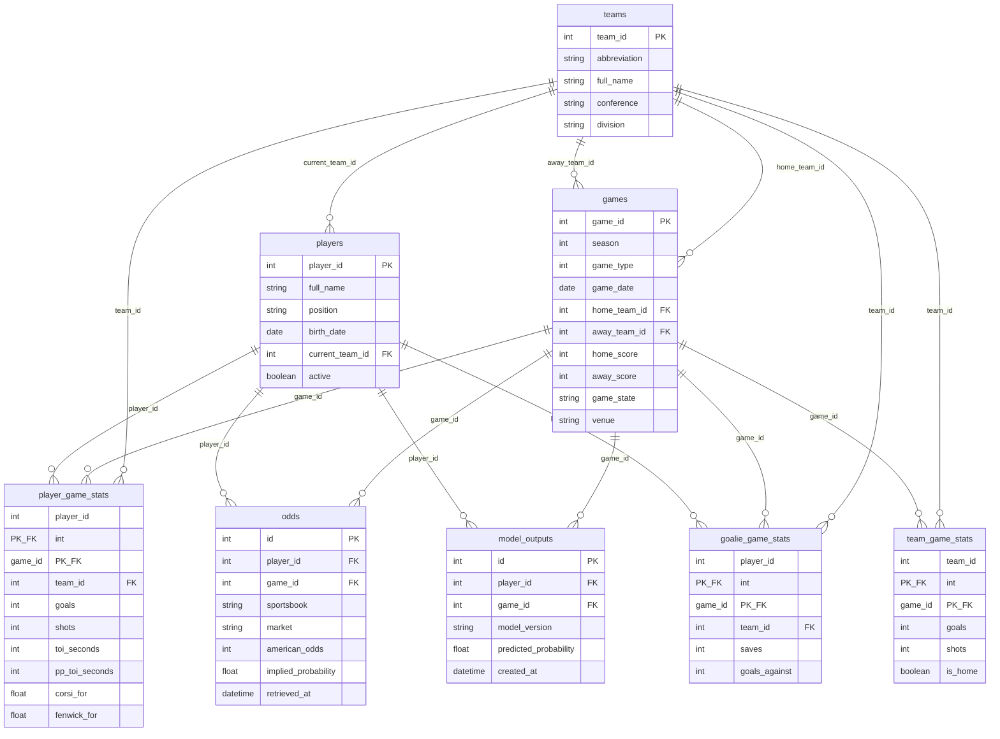

# Database ERD (SQLite)

Entity-relationship view of `data/nhl_forecasting.db` (SQLAlchemy models in `database/models.py`).

## Notes

- **Composite keys:** `player_game_stats`, `team_game_stats`, and `goalie_game_stats` use `(player_id or team_id, game_id)` as the primary key.
- **Uniqueness:** `odds` is unique on `(player_id, game_id, sportsbook, market)`. `model_outputs` is unique on `(player_id, game_id, model_version)`.
- **Skater vs goalie:** Skater rows live in `player_game_stats`; goalies also have `goalie_game_stats`. The feature pipeline excludes goalies from skater `player_game_stats` when building the matrix.

Render this file in GitHub, GitLab, or any Mermaid-compatible viewer (VS Code extension “Markdown Preview Mermaid Support”, etc.).
